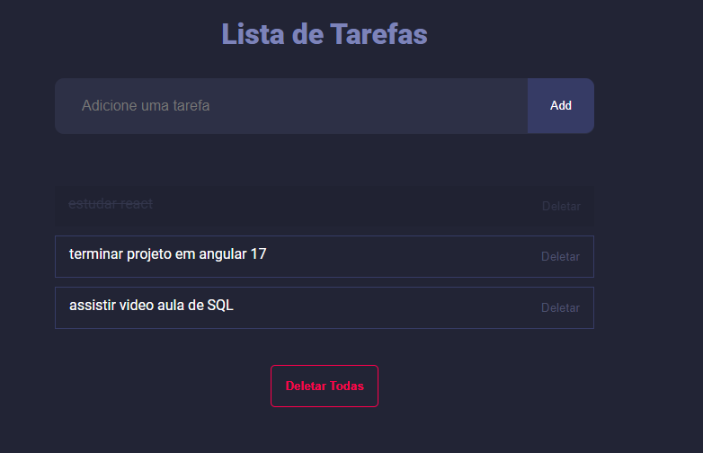

  

# LISTA DE TAREFAS
Aplicação de LISTA DE TAREFAS para adicionar, conclusão e excluir tarefas. 

 
<h3 align="center">Desenvolvido em: </h3>

    
    
    

 

### 📘 Ferramentas/Bibliotecas utilizadas
  - Biblioteca para criação de interfaces: `reactJS`
  - Setup para criar o projeto no React: `ViteJS`
  
 
  
✔️ Feito com ♥ by Luciene Freitas 